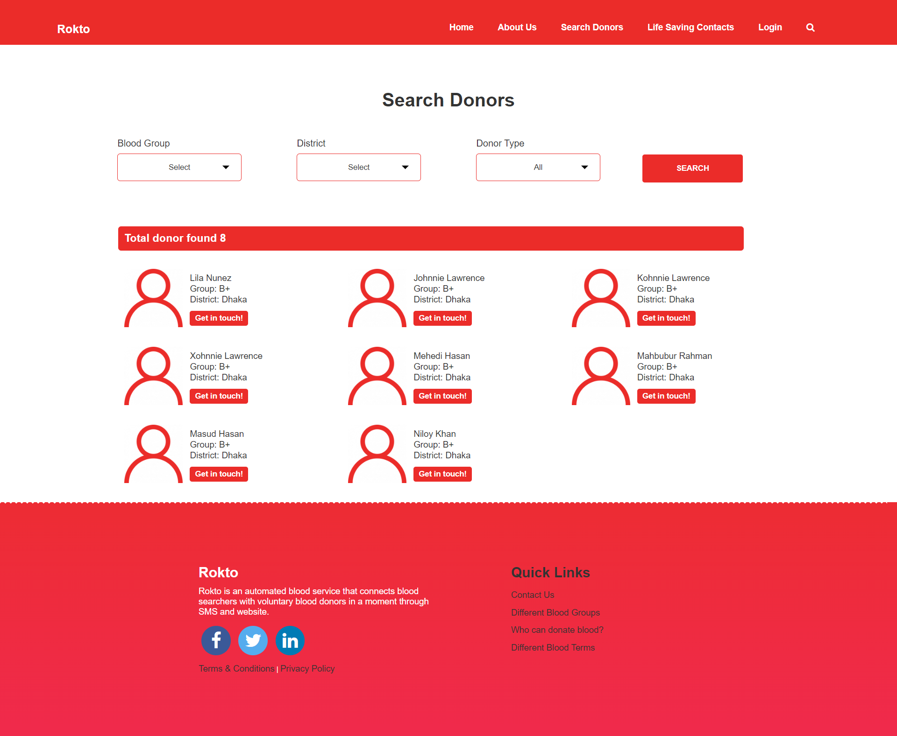

# Blood Donor Management System

A web-based application for blood donor management, allowing individuals to register as donors and facilitating the search for available donors based on location. 

## Copyrights
This was my first web project on 2021. I took inspiration from [rokto.co](https://www.rokto.co/) 
for that reason you might find this project almost simmilar to that website but I couldn't achieve that much functionality as rokto.co has.

## Features

- User registration and profile management
- Donor registration with blood type and location details
- Search functionality to find donors based on location
- user-friendly interface

## Technologies Used

- PHP
- MySQL
- HTML
- CSS

## Browser Compatibility

While this project generally works well on Mozilla Firefox browsers, there might be some compatibility issues on other browsers. If you encounter problems, consider using Firefox for the best experience.

## Installation

1. Enter 'rokto_db' as the database name in phpMyAdmin.
2. Import 'rokto_db.sql'.
3. Explore `db-connect.php` to configure `$dbname`, `$dbserver`, `$dbuser`, and `$dbpwd` if needed.

## Here are some sample screenshots of the project
 - Screenshot 1 
 

- Screenshot 2

- Screenshot 3

